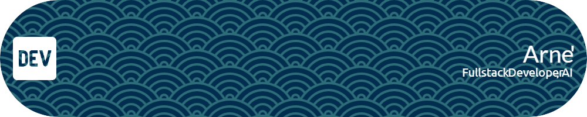

Passionate about crafting innovative and imaginative creations, I thrive on infusing the online realm with excitement and intrigue. My journey involves a deep dive into the realms of AI, leveraging my expertise in technologies such as Typescript, GoLang, Rust, Vue, and Svelte. I navigate the databases of possibilities with proficiency in PostgreSQL and MySQL. Driven by a fervor for automation and a penchant for crafting impressive digital experiences, I specialize in bringing ideas to life through innovative applications and websites. My passion lies in streamlining processes and building solutions that not only function seamlessly but leave a lasting impression. Join me on this journey of transforming concepts into captivating digital realities, where automation meets creativity to shape a more efficient and engaging online world.

<!--
**avxart/avxart** is a ✨ _special_ ✨ repository because its `README.md` (this file) appears on your GitHub profile.

Here are some ideas to get you started:

- 🔭 I’m currently working on ...
- 🌱 I’m currently learning ...
- 👯 I’m looking to collaborate on ...
- 🤔 I’m looking for help with ...
- 💬 Ask me about ...
- 📫 How to reach me: ...
- 😄 Pronouns: ...
- ⚡ Fun fact: ...
-->
